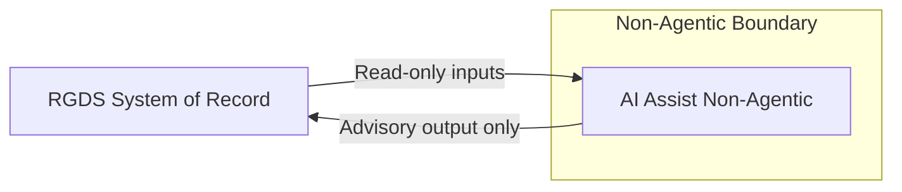
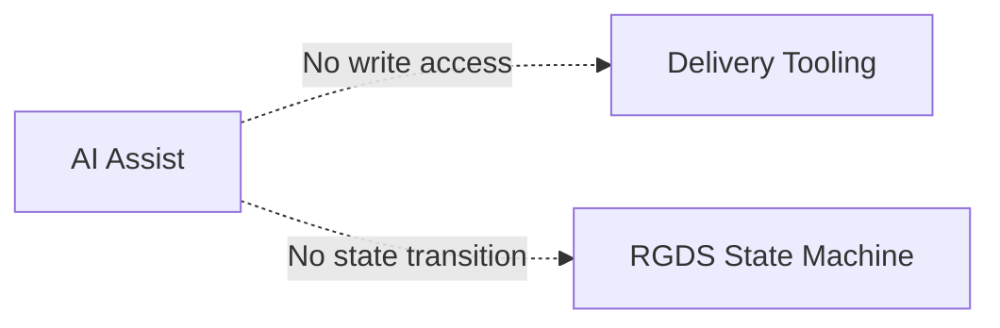

## Diagram 1 — Executive Authority Flow

Purpose:
Make it impossible to misread who has authority.

Rules:
- No AI arrows touching delivery tools
- No “blocked” labels
- No optional flows
- No negative statements

> **Invariant:** Decision authority, state transitions, and risk acceptance are human-owned by design.  
> AI participation is advisory, bounded, and removable without invalidating decisions.

Humans are the only actors that can change decision state.  RGDS is the system of record.  Delivery tooling consumes approved decisions

---

## Diagram 2 — AI Assistance Boundary

Purpose:
Show AI participation without authority.

Rules:
- AI interacts with RGDS only
- No arrows to delivery
- “Blocked” becomes a boundary, not an edge

AI operates only within a non-agentic boundary and has no execution surface.  Outputs are advisory and cannot change decision state.

---

## Diagram 3 — Structural Non-Agentic Constraints

This is where “blocked” finally belongs.

These paths are structurally prohibited by design, not policy.
