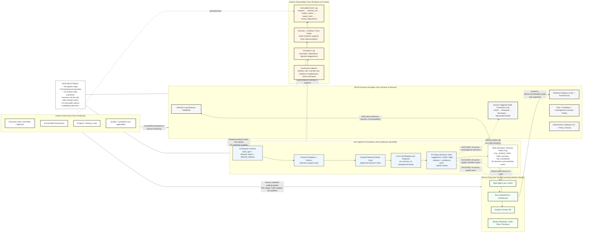

```mermaid
flowchart LR
  %% =========================================================
  %% RGDS — AI Governance Technical Architecture (Non-Agentic)
  %% View 1: Single-Page Architecture (Technical Executive View)
  %% =========================================================

  %% ---------- Styles ----------
  classDef human fill:#fff,stroke:#111,stroke-width:2px;
  classDef rgds fill:#f7f7f7,stroke:#111,stroke-width:2px;
  classDef ai fill:#eef6ff,stroke:#111,stroke-width:2px,stroke-dasharray: 6 3;
  classDef integ fill:#f4fff4,stroke:#111,stroke-width:2px;
  classDef audit fill:#fff6e6,stroke:#111,stroke-width:2px;
  classDef block fill:#ffffff,stroke:#111,stroke-width:2px,stroke-dasharray: 3 3;

  %% ---------- Human Governance Zone ----------
  subgraph HZ["Human Governance Zone (Authority)"]
    direction TB
    H1["Executive Gate Committee / Approver"]:::human
    H2["Accountable Reviewer(s)"]:::human
    H3["Program / Delivery Lead"]:::human
    H4["Quality / Compliance (as applicable)"]:::human
  end

  %% ---------- RGDS Decision Discipline Zone ----------
  subgraph RZ["RGDS Decision Discipline Zone (System of Record)"]
    direction TB
    R1["Decision Log (Schema-Validated)"]:::rgds
    R2["Evidence Registry (Links + Provenance)"]:::rgds
    R3["Risk / Conditions / Contingencies (Owned Fields)"]:::rgds
    R4["Deterministic Validators (CI + Policy Checks)"]:::rgds
    R5["Human-Triggered State Transitions Only\n(Draft → Proposed → Reviewed → Approved/Closed)"]:::rgds
  end

  %% ---------- Non-Agentic AI Assistance Zone ----------
  subgraph AZ["Non-Agentic AI Assistance Zone (Optional, Bounded)"]
    direction TB
    A1["AI Request Contract\n(task_type + allowed_inputs + allowed_outputs)"]:::ai
    A2["Prompt Templates + Rubrics\n(decision-support only)"]:::ai
    A3["Scoped Retrieval (Read-Only)\n(Approved Sources Only)"]:::ai
    A4["LLM Call (Stateless per Request)\n(no memory, no background loops)"]:::ai
    A5["AI Output (Advisory Only)\n- suggestions / drafts / flags\n- citations + confidence band\n- abstain option"]:::ai
    A6["Write Boundary: Advisory Fields Only\n(e.g., analysis_notes, draft_summary,\n risk_candidates)\nNO decision outcome/state writes"]:::block
  end

  %% ---------- Service Execution / Delivery Zone ----------
  subgraph SZ["Service Execution Zone (Consulting Delivery Model)"]
    direction TB
    S1["Work Mgmt (Jira / ADO)"]:::integ
    S2["Docs (SharePoint / Confluence)"]:::integ
    S3["Analytics (Power BI)"]:::integ
    S4["Rituals (Standups / Gate Prep / Reviews)"]:::integ
  end

  %% ---------- Audit & Observability Zone ----------
  subgraph OZ["Audit & Observability Zone (Evidence of Control)"]
    direction TB
    O1["Immutable Event Log\n(request → retrieval_set → model_version → output_hash → human_disposition)"]:::audit
    O2["Decision↔Evidence Trace Graph\n(what evidence supports what claim/condition)"]:::audit
    O3["Exception Log\n(overrides, abstentions, rejected suggestions)"]:::audit
    O4["Governance Metrics\n(abstain rate, override rate, evidence completeness,\n time-to-decision)"]:::audit
  end

  %% ---------- Primary Flows ----------
  HZ -->|"Create/Review/Approve (Human Authority)"| RZ

  %% RGDS can request bounded AI assistance (no authority transfer)
  RZ -->|"Request analysis (read-only inputs)\nNO authority coupling"| A1
  A1 --> A2 --> A3 --> A4 --> A5 --> A6
  A6 -->|"Advisory fields only\n(no state transition)"| RZ

  %% Integrations: read from RGDS; writes are human-mediated
  RZ -->|"Read model (source of truth)"| S3
  S2 -->|"Evidence references/metadata (read-only ingestion)"| R2
  S1 -->|"Work items reference decision_id (traceability)"| R1

  %% Publish/Update actions must be human-mediated
  HZ -->|"Human-mediated publish/update\n(PR merge / ticket update / doc publish)"| SZ

  %% Audit taps (capture everything)
  HZ -.->|"who/when/why"| O1
  RZ -.->|"schema + policy validation results"| O1
  AZ -.->|"inputs/outputs (hashed) + citations"| O1
  RZ -.-> O2
  AZ -.-> O3
  RZ -.-> O4

  %% ---------- Explicitly Blocked Paths (No Autonomy) ----------
  A5 -.-x|"BLOCKED: AI cannot update Jira/ADO status"| S1
  A5 -.-x|"BLOCKED: AI cannot publish docs"| S2
  A5 -.-x|"BLOCKED: AI cannot close/approve decisions"| R5

  %% ---------- Non-Agentic Guarantees (callouts) ----------
  NG1["NON-NEGOTIABLE:\n• No agentic loops\n• No background execution\n• No implicit state transitions\n• Humans are the only state-change actors\n• AI removable without invalidating decisions"]:::block
  NG1 --- RZ
  NG1 --- AZ
```
