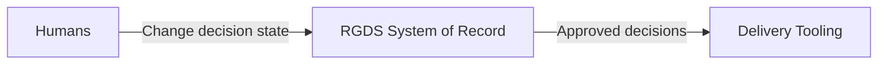

Purpose:
Make it impossible to misread who has authority.

Rules:
No AI arrows touching delivery tools
No “blocked” labels
No optional flows
No negative statements

Humans are the only actors that can change decision state.
RGDS is the system of record.
Delivery tooling consumes approved decisions.

